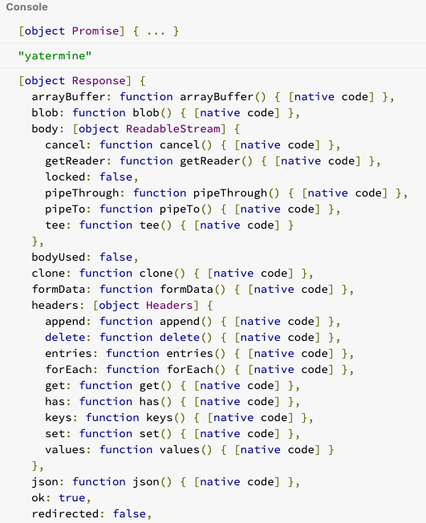

JavaScript es un lenguaje de programación síncrono que
se ejecuta sobre **un solo hilo** y es asíncrono gracias a las API del navegador.

Es síncrono pero el sabe manejar las peticiones de forma virtual
osea que el motor si es síncrono. pero como esta hecho puede ejecutar cosas asíncronas.

Para poder trabajar JavaScript con el event loop JavaScript introduce el concepto de promesas, que nos permiten definir código a ejecutarse, cuando una tarea fue finalizada

### Una promesa es un tipo de objeto retornado por una operación asíncrona, utilizando este objeto podemos obtener el valor final de la operación asíncrona o sus errores

### Una promesa es un objeto que va producir un valor en el futuro

Una promesa se puede encontrar en uno de los siguientes estados:

- fullfied: Completada significa que la promesa se completó con éxito
- rejected: Rechazada significa que la promesa no se completó con éxito
- pending: Pendiente que es el estado de la promesa cuando la operación no ha terminado, aquí decimos que la promesa no se ha cumplido
- settled: finalizada cuando la promesa término ya sea con éxito o con algún error

vamos a la práctica con fetch:

fetch por naturaleza es una operación asíncrona

```js
let request = fetch("https://api.github.com/users/codigofacilito");
console.log(request);

//[object Promise] { ... }
```

Podemos ver que es una objeto de tipo promesa, también podemos usar typeof para ver de que tipo es un object de tipo promesa, fetch retorna un objeto promesa y no el resultado en si y es que a través de la promesa que nosotros finalmente podemos acceder a la información que realidad queríamos de la operación asíncrona y para poder obtener esa información hay 3 métodos
de una promesa que podemos ocupar y que se van ejecutar cuando la operación termine para que nosotros podemos obtener la información que queremos

1. La primera de ella es then() -> ejecuta cuando la operación terminó con éxito **then() es para el caso de éxito**

```js
let request = fetch("https://api.github.com/users/codigofacilito");
console.log(request);

p.then(function (resultado) {
  console.log("ya termine");
  console.log(resultado);
});
```

acá tenemos el resultado de la operación final.



Qué define que una operación asíncrona ha sido exitosa o no se haya ejecutado algún error o no se haya lanzado algún error durante la ejecución asíncrona.

podemos mandar un segundo callback para recibir el error, pero idealmente para que sea mas legible o más expresivo es mejor utilizar catch

2. Nos muestra el caso de una promesa cuando esta falla, es un método al cual le pasamos una función y este se va ejecutar si la petición asíncrona fallo y justamente podemos usar el argumento recibido para identificar por que fallo

```js
let request = fetch("https://codigofacilito.com/articulos/");
console.log(request);

request.then(function (resultado) {
  console.log("ya termine");
  console.log(resultado);
});

request.catch(function (err) {
  console.log("Petición asíncrona fallada");
  console.log(err);
});
```

no hay encabezados CORS se arroja un error que es diferente a que la petición responda con un 500 o con un 400

3. finally, recibe una función que se va ejecutar independientemente si termina con error o no la petición asíncrona, finally se ejecuta

```js
let request = fetch("https://api.github.com/users/codigofacilito");
console.log(request);

request.then(function (resultado) {
  console.log("ya termine");
  console.log(resultado);
});

request.catch(function (err) {
  console.log("Petición asíncrona fallada");
  console.log(err);
});

request.finally(function (d) {
  console.log("termine");
});
```

```js
let request = fetch("https://api.github.com/users/codigofacilito");
console.log(request);

request.then(function (resultado) {
  console.log("ya termine");
  resultado.json().then(function (json) {
    console.log(json);
  });
});
```

en este caso el método json de un response de fetch es otra operación asíncrona que convierte la información que viene en formato json, esto también retorna una promesa por ser una operación asíncrona, esta esta forma pero podemos retornar una promesa \*\*y esto nos permite encadenar el siguiente then()

```js
let request = fetch("https://api.github.com/users/codigofacilito");
console.log(request);

request
  .then(function (resultado) {
    console.log("ya termine");
    return resultado.json();
  })
  .then(function (json) {
    console.log(json);
  });
```

esto es para claridad para no tener una sintaxis anidad de promesas.

- tomar en cuenta una promesa se ejecuta después de la otra:
  - en este caso espera que termine el fetch una vez que termina el fetch para a siguiente operación asíncrona, que sería transformalo a json y finalmente llega hasta acá
