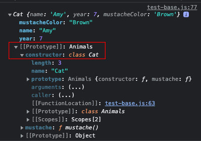

# JavaScript no es un lenguaje orientado a objetos basado en clases. Pero todavía tiene formas de usar la programación orientada a objetos (POO).

Según Wikipedia, la programación basada en clases es:

"...un estilo de programación orientada a objetos (POO), en el que
la herencia se produce mediante la definición de clases de objetos, en lugar de
que la herencia se produzca únicamente a través de los objetos..."

El modelo más popular de POO está basado en clases.

**Pero JavaScript no es un lenguaje basado en clases, es un lenguaje
basado en prototipos.**

"Un lenguaje basado en prototipos toma el concepto de objeto prototípico, un objeto
que se utiliza como una plantilla a partir de la cual se obtiene el conjunto inicial
de propiedades de un nuevo objeto."

Vamos analizandoo código

```js
let names = {
  firstName: "Kyo",
  lastName: "Rioku",
};
console.log(names.firstName);
console.log(names.hasOwnProperty("secondName"));
// Resultado esperado:
// Kyo
// false
```

El objeto de la variable names solo tiene dos propiedades: firstName y lastName. Ningún método en absoluto.

Entonces, ¿de dónde viene hasOwnProperty?

Bueno, viene del prototipo Object.

```js
console.log(nombres);
```

Cuando expandas los resultados en la consola, obtendrás esto:


¿Notas la última propiedad: **<prototype>?** Intenta expandirlo:

Verás un conjunto de propiedades en el constructor Object. Todas
estas propiedades provienen del prototipo Object global.
Si observas de cerca, también notarás nuestra propiedad hasOwnProperty.

## La propiedad <prototype>

Esto apunta al objeto que se utiliza como prototipo.

Esta es la propiedad de cada objeto que le da acceso a la propiedad
Object prototype(Prototipo de objeto).

## Modificando la propiedad <prototype>

Esta propiedad se puede modificar, indicando explícitamente
que debería referirse a otro prototipo. Se utilizan los siguientes
métodos para lograr esto:

Método Object.create():

```js
function Perro(nombre, edad) {
  let perro = Object.create(ObjetoConstructor);
  perro.nombre = nombre;
  perro.edad = edad;
  return perro;
}

let ObjetoConstructor = {
  habla: function () {
    return "¡Soy un perro!";
  },
};

let firulais = Perro("Firulais", 9);
console.log(firulais);
```

En la consola, esto es lo que tendrías:


¿Observas la propiedad **<prototype>** y el método habla?

Object.create usa el argumento que se le pasa para convertirse
en el prototipo.

## Palabra clave new:

```js
function Perro(nombre, edad) {
  this.nombre = nombre;
  this.edad = edad;
}

Perro.prototype.habla = function () {
  return "¡Soy un perro!";
};

let bobby = new Perro("Bobby", 12);
```

La propiedad <prototype> de bobby, es dirigida al prototipo de Perro.
Pero recuerda, el prototipo de Perro es un objeto (par clave y valor),
por lo tanto, también tiene una propiedad <prototype> que se refiere al
prototipo de objeto global.

Esta técnica se conoce como **PROTOTYPE CHAINING (encadenamiento de prototipos).**

Ten en cuenta que: la palabra clave **new,** hace lo mismo que **Object.create()** pero solo
lo hace más fácil, ya que hace algunas cosas automáticamente por ti.

**Cada objeto en JavaScript tiene acceso al prototipo de Object por defecto.
Si está configurado para usar otro prototipo, digamos prototype2, entonces
prototype2 también tendría acceso al prototipo de Object por defecto, y así sucesivamente.**

## Combinación de objeto + función

Probablemente estés confundido por el hecho de que Perro es una función (function Perro(){}),
y tiene propiedades a las que se accede con una notación de puntos. Esto se conoce como una
combinación de objeto y función.

Cuando se declaran funciones, por defecto, se les asignan muchas propiedades adjuntas.
Recuerda que las funciones también son objetos en los tipos de datos de JavaScript.

# Clases

JavaScript introdujo la palabra clave **class** en ECMAScript 2015.
Hace que JavaScript parezca un lenguaje POO. Pero solo es azúcar
sintáctico sobre la técnica de creación de prototipos existente.
Continúa con la creación de prototipos en segundo plano, pero hace
que el cuerpo exterior parezca POO. Ahora veremos cómo es posible.

El siguiente ejemplo es un uso general de una **class** en JavaScript:

```js
class Animales {
  constructor(nombre, especie) {
    this.nombre = nombre;
    this.especie = especie;
  }

  canta() {
    return `${this.nombre} puede cantar`;
  }

  baila() {
    return `${this.nombre} puede bailar`;
  }
}

let bango = new Animales("Bango", "Akita");
console.log(bango);
```


El <prototype> hace referencia al prototipo de Animales
(que a su vez hace referencia al prototipo de Object).

A partir de esto, podemos ver que el constructor define las
características principales, mientras que todo lo que está
fuera del constructor (canta() y baila()) son las características
adicionales (prototipos).

En segundo plano, utilizando el enfoque de la palabra clave **new,**
lo anterior se traduce en:

```js
class Animales {
  constructor(nombre, especie) {
    this.nombre = nombre;
    this.especie = especie;
  }

  Animales.prototype.canta() {
    return `${this.nombre} puede cantar`;
  }

 Animales.prototype.baila() {
    return `${this.nombre} puede bailar`;
  }
}

let bango = new Animales("Bango", "Akita");
```

## Sub-clases

Esta es una característica en **POO,** donde una clase hereda características de una clase padre, pero posee características adicionales que el padre no tiene.

La idea aquí es, por ejemplo, decir que quieres crear una clase de Gatos. En lugar de crear la clase desde cero, indicando de nuevo las propiedades del nombre, la edad o la especie, heredaría esas propiedades de la clase padre Animales.

Esta clase Gatos puede tener propiedades adicionales como el color de los bigotes. Veamos cómo se hacen las sub-clases con class.

Aquí, necesitamos un padre del que herede la sub-clase. Examinemos el siguiente código:

```js
class Animals {
  constructor(name, year) {
    this.name = name; //asigna la nueva prop
    this.year = year; //asigna la nueva prop
  }

  sing() {
    return `${this.name} can sing`; //propiedades del protoype : Object
  }
  dance() {
    return `${this.name} can dance`; //propiedades del protoype : Object
  }
}

class Cat extends Animals {
  constructor(name, year, mustacheColor) {
    super(name, year); //hereda propiedades
    this.mustacheColor = mustacheColor; //asigna la nueva prop
  }

  mustache() {
    return `I have mustache color ${this.mustacheColor}`; //propiedades del protoype : Object
  }
}

let amy = new Cat("Amy", 7, "Brown"); //instancia del objeto que extiende de class Animals

console.log(amy.sing());
console.log(amy.dance());
```

Con lo anterior, obtenemos los siguientes resultados:

```bash
//Amy can sing
//Amy can dance
```



Notarás que amy tiene una propiedad <prototype> que hace
referencia al constructor Cat y obtiene acceso al método mustache().
Esta propiedad <prototype> también tiene una propiedad <prototype>
que hace referencia al constructor Animals obteniendo así acceso a sing()
y dance().

name y year son propiedades que existen en cada objeto creado
a partir de este. Usando el enfoque del método Object.create, lo
anterior se traduce en:

```js
function Animals(name, year) {
  let newAnimal = Object.create(ConstructorAnimals);
  newAnimal.name = name;
  newAnimal.year = year;
  return newAnimal;
}

let ConstructorAnimals = {
  sing: function () {
    return `${this.name} can sign`;
  },
  dance: function () {
    return `${this.name} can dance`;
  },
};

function Cats(name, year, colorMustaches) {
  let newCat = Animals(name, year); //super
  Object.setPrototypeOf(newCat, ConstructorCats);
  newCat.colorMustaches = colorMustaches;
  return newCat;
}

let ConstructorCats = {
  mustaches() {
    return `I have color mustaches ${this.colorMustaches}`;
  },
};

Object.setPrototypeOf(ConstructorCats, ConstructorAnimals);
const amy = Cats("Amy", 33, "violet");

console.log(amy.sing()); //Amy can sign
console.log(amy.mustaches()); //I have color mustaches violet
```

Object.setPrototypeOf es un método que toma dos argumentos: el objeto (primer argumento)
y el prototipo deseado (segundo argumento).

De lo anterior, la función **Animals** devuelve un objeto con
**ConstructorAnimal** como prototipo. La función **Cats** devuelve
un objeto con **ConstructorGato** como prototipo. **ConstructorCats,**
por otro lado, recibe un prototipo de **ConstructorAnimal.**

Por lo tanto, los animales comunes solo tienen acceso al
ConstructorAnimal, pero los Cats tienen acceso al **ConstructorCats**
y al **ConstructorAnimal.**
