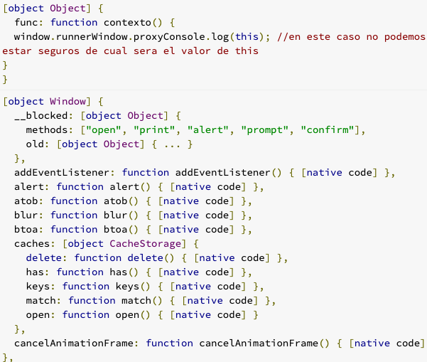

# El contexto

El contexto es el valor que tiene this y usualmente hace referencia al objeto sobre el que se esta ejecutando el código

this contexto

Vamos a ver el valor que adopta this en distintos escenarios:

Cuando una función no le pertenece a ningún objeto
el valor de this es el objeto global, el caso de los navegadores es el objeto **window** pero si ejecutan este mismo código en node js sería **global**

```js
//el valor de this es el contexto que ejecuta la función, se determina al momento de usar la función no al momento de escribir o redactar la función
function contexto() {
  console.log(this); //en este caso no podemos estar seguros de cuál será el valor de this
}

let objeto = {
  func: contexto,
};

objeto.func();

contexto();
```

ahora el contexto en este caso es el contexto de **let objeto**



- Primera ejecución el contexto es el objeto
- En la segunda ejecución el contexto es el objeto global

La clave para entender que valor adopta el contexto, este valor depende de como se esta ejecutando la función y no depende de la declaración de la función, **this** se determina hasta que se ejecute la función y no en la declaración de la función

**👀 el contexto depende de laejecuciónn y no de la declaración**

## que pasa con el contexto en las funciones de flecha

Las funciones de flechas no asignan un valor de this, lo heredan del contexto en el que se ejecutan.

Si usas **this** en una función flecha, este toma el contexto padre (del exterior)

```js
let objeto = {
  numeros: [1,2,3,4],
  imprimir: function() {
    console.log(this);//aquí 1
    this.numeros.forEach(funtion() {
      console.log(this);//aquí 2
    })

  }
}

objeto.imprimir()
```

nos va imprimir en consola el object

```js
let objeto = {
  numeros: [1, 2, 3, 4],
  imprimir: function () {
    console.log(this); //aquí 1
    this.numeros.forEach(() => {
      console.log(this); //aquí 2
    });
  },
};

objeto.imprimir();
```

este va ser el contexto donde si necesitamos un arrow function ya que necesitamos el contexto exterior

## Resumen

- Las funciones de flecha no cambian el valor de this, lo heredan o lo toman de afuera

- Esto abre la puerta a usar las funciones de flecha cuando no queremos que el contexto en el cuerpo de la función cambie
