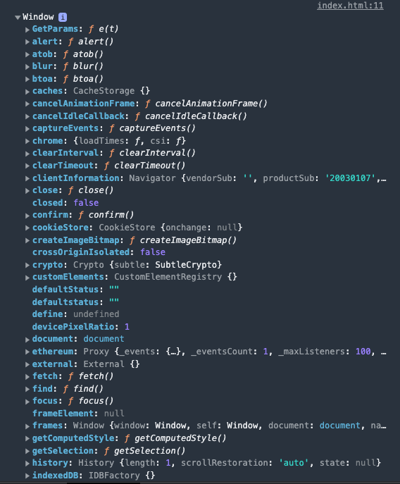

# this

Palabra reserbada this

**this** es una palabra que hace referencia al objeto que estamos trabajando

1- Lo primero que tenemos que entender cuando tenemos javascript en los navegadores

```js
console.log(this);
```

**this** va hacer referencia al objeto global y el objeto global es este objeto que se llama
window



se ejecutamos este código en node js no devolveria global que es el objeto global

entonces si objeto global en navegador es window esto validaría a true

```js
console.log(this === window); //true
```

ahora se ejecuto el siguiente código no va devolver en consola **contexto global**

```js
this.nombre = "contexto global"; //creamos una variable al window
console.log(this.nombre); //contexto global
```

```jsx
this.nombre = "contexto global";
console.log(this.nombre);

function imprimir() {
  console.log(
    this.nombre +
      " sigue imprimiendo la variable global ya que sigo en el ambito"
  );
}

imprimir();
```

sigo imprimiendo el contexto global al ejecutar mi funcion imprimir()

ahora vamos analizar donde se esta ejecutando el this.nombre dentro de mi const objeto

```js
const obj = {
  name: "Contexto Objeto",
  imprimir: function () {
    console.log(this.name);
  },
};

obj.imprimir();
```

Vemos que this se esta ejecutando dentro del scope apunato a name: "Contexto Objeto", esta función
anónima ha sido creada dentro del contexto del objeto por eso a la hora de llamar al método obj.imprimir();
me marca Contexto Objeto y no contexto global

Vamos a crear un objeto 2 pero el imprimir de ese objeto a quien va hacer referencia a la función que tenemos declarada
en el scope global del archivo. si el nombre de la var que guarda el valor es el mismo

simplemente lo podemos simplicar a esto

imprimir: imprimir
imprimir

ahora el contexto donde se ecuentra this.nombre dentro de la función, es el contexto del objeto numero 2
ya que como esta definida solo la llamamos dentro del objeto > le asignamo como valor una función que ya estaba declarada

```js
console.log(this);

this.nombre = "contexto global";
console.log(this.nombre);

function imprimir() {
  console.log(this.nombre);
}

imprimir();

const obj = {
  name: "Contexto Objeto",
  imprimir: function () {
    console.log(this.name);
  },
};

obj.imprimir();

const obj2 = {
  nombre: "Contexto Objeto 2",
  imprimir, // asigne como valor una función que ya estaba declarada
};

obj2.imprimir();
```

## arrow function

Aquí hay un detalle hasta cierto punto soluciona pero tambien crea conflictos con las arrow function
aquí lo que hace una arrow function, es manetener un el enlace del contexto que ha sido creado
el objeto donde aparece, a diferencia de esta function anonima, que es una function como tal maneja su propio
scope. El contexto de la palabra this lo que hace es tomarlo directamente del padre del objeto en el que se
ha creado es por eso que no esta imprimiendo el contexto global. Esto enlazar el contexto de padre al hijo
es muy similar a lo que hace el metodo bind, de hecho del metodo call apply y bind estan muy realacionados
al método this, entonces ese es una de las caracteristicas por las cuales

```js
const obj3 = {
  nombre: "Contexto Objeto 3",
  imprimir: () => {
    console.log(this.nombre);
  },
};

obj3.imprimir();
```

Cuando estás trabajando en la creación de un objeto y dentro de ese objeto tienes propiedades tienes
métodos y esos metodos van a interactuar con propiedades de objeto literal **NO** se recomienda que utilices
**arrow function** si no utliza funciones anonimas.

¿ Por qué ?
Las arrow function no crean un scope, se salta el scope en que ha sido creado, obedece al contexto global en el cual ha sido creado el objeto

por eso es que **obj3.imprimir();** en este caso como obj3 ha sido creado en el contexto global, por es que nos esta imprimiendo
**Contexto Global**
**obj3** fue creado en dicho contexto

- las arrow function no generan scope a diferencia de las funciones anónimas

## función constructora que crea su propio scope

```js
function Persona(nombre) {
  this.nombre = nombre;
  return console.log(this.nombre);
}

let kyo = new Persona("Kyo");
```

Que pasa si en vez de retornar el console.log()

👀 Recordemos que las funciones son ciudadonos de primer clase sirven para crear objetos
las funciones sirven para todo para crear:

- objetos
- prototipos
- se pueden pasar como parametros
- la podemos retornar como el resultado de otra funciós

Eso en el mundo de la programación en javascript se conoce como **clausura o closure**
porque estamos envolviendo un función dentro de una función y la estamos retornando.
Aquí voy crear una función anónima, la mandamos en return luego esa función ejecuta la linea
del console.log()

```js
function Persona(nombre) {
  this.nombre = nombre;
  //return console.log(this.nombre);
  return function () {
    console.log(this.nombre);
  };
}

let kyo = new Persona("Kyo");
```

Vemos que esto es solo la declaración

```js
return function () {
  console.log(this.nombre);
};
```

para que esto se invoque yo tendria que ejecutar la instancia de persona que este caso es la variable kyo

```js
kyo();
```

vamos a ejecutarla como método por que finalmente esta retornando un función

```js
function Persona(nombre) {
  this.nombre = nombre;
  //return console.log(this.nombre);
  return function () {
    console.log(this.nombre, "return f()");
  };
}

let kyo = new Persona("Kyo");
kyo();
```

Ahora ¿ por qué ? me esta diciendo contexto global

Recapitulemos cada función crea un contexto salvo las arrow function heredan el contexto en cual han sido creado

- Que pasa aquí la función constructora tiene su propio scope y le estoy pasando como argumento nombre
- dentro de la función constructora estoy asignando una variable, **this.nombre = nombre;** es igual al nombre
  que recibe como parametro

Entonces cuando yo ejecute este console.log() directo al return **si existe**
**return console.log(this.nombre);**

Esta nueba function solita crea un nuevo scope, crea un nuevo contexto internamente esta function anonima
no tiene ninguna propiedad nombre

```js
return function () {
  console.log(this.nombre, "return f()");
};
```

entonces como no tiene un propiedad nombre lo único que hace es regresarse y leer el this del Contexto Global
por eso en consola nos muestra Contexto Global en lugar de Kyo

cual sería la solución con ecmascript 2015 en lugar de tenerlo en una función anónima
🧠 recordemos que las arrow function no crean scope interno

entonces si yo esto en lugar de retornarlo como una función anónima la **retorno como una arrow function**

```js
return () => console.log(this.nombre, "return f()");
```

## antes de las arrow function de esta forma solucionábamos

usabamos var pero ahora como tenemos const lo vamos aplicar con const

guardar el contexto this de esta función constructora para que si después retornas una función anónima, puedas
recuperar ese this
