# Event Lopp

## source

[source](https://kriyavikalpa.com/2022/02/12/javascript-quick-revision-2/)

## Cómo funciona realmente javascript ?

Buenos hemos escuchado del V8, el Runtime de chrome pero nada sabía
a ciencia cierta qué era o que hacía. También hemos escuchado sobre monoprocesos o callback

## Javascrip qué rayos eres ?

Soy un lenguaje de monoproceso concurrente.
Yo Tengo:

- Call Stack
- Event Loop
- callback queue

caracteristicas del lenguaje

single threaded
non blocking
asynchronous
concurrent

Tengo un:

- callstack
- heap o memory heap

Si miramos un runtime de Javascript como V8, que es el runtime de chrome
este es una imagen simplificada de lo que es el runtime en JS


## Heap

Es donde se produce la asignación de memoria y la pila de llamadas

heap(asignación de memoria) - stack(pila de tareas o llamadas)

el V8 puede hacer varias cosas como:
setTimeout, DOM y HTTP Request y verás que no están allí, no existen en
V8. Es algo extraño conocer al principio, porque setTimeout lo primero que usas cuando piensas en cosas asíncronas y no estan dentro del v8

lo que hay que entender que tenemos el runtime del v8 pero esas cosas que se llaman asíncronas son las **Web Apis** y que son otras cosas que nos proporciona el navegador

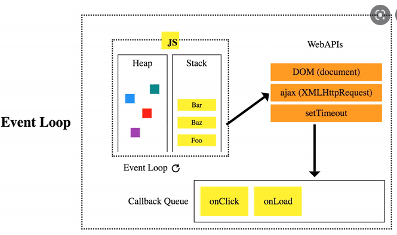

tenemos el mítico event loop y el callback queue(cola de callbacks)

## the call stack

one thread == one callstack == one thing at a time

JavaScript es un lenguaje de programación monoproceso, con un runtime monoproceso y una sola pilla de llama (call stack)

- **Puedo hacer una cosa a la vez, que es lo que significa monoproceso,
  que el programa puede ejecutar una porción de código a la vez**

**Call Stack**

Como podemos ver tenemos alguna funciones como un multiplicador:

- multiply: multiplica dos números
- square: llama a la función multiplicar por el mismo número
- printSquare: una función que imprime el cuadrado llamando una función y haciendo luego un console.log
- al final de nuestro archivo ejecutamos printSquare(4)

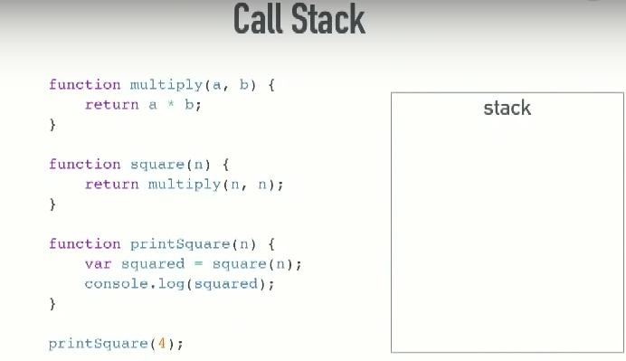

Si ejecutamos esto:
basicmante el call stack es una estructura de datos que registra en que parte del programa que estamos

si ejecutamos este archivo hay una función main() que viene a ser el propio archivo y eso se mete en la pila, luego tenemos alguna definiciones de funciones y al final tenemos printSquare(4)

eso llama a función -> printSquare(n)

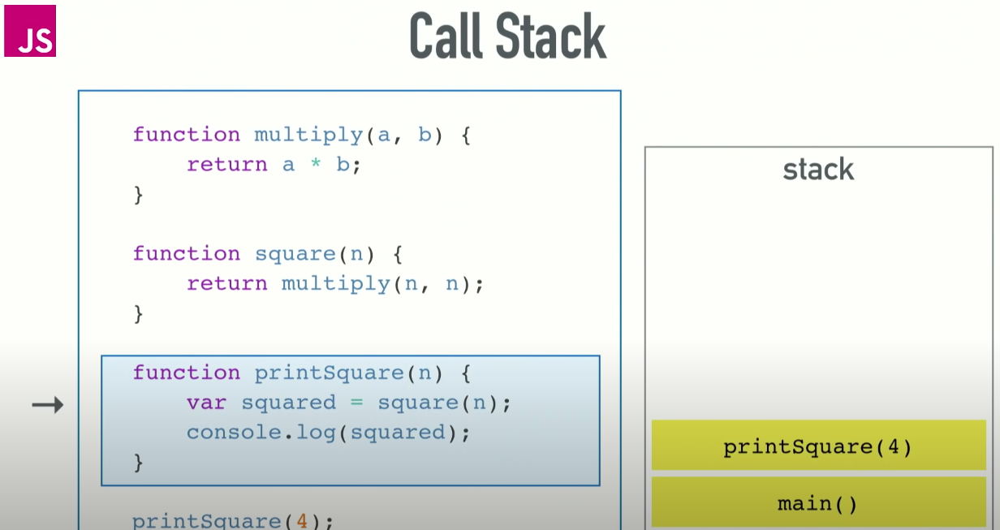

vamos dentro de printSquare se mete en la pila -> square(n)


llama a multiply ahora tenemos un return multiplicamos a y b y regresamos
cuando retornamos sacamos algo de la pila

volvemos a imprimir printSquare(n) en el console.log() no hay retorno es implícito

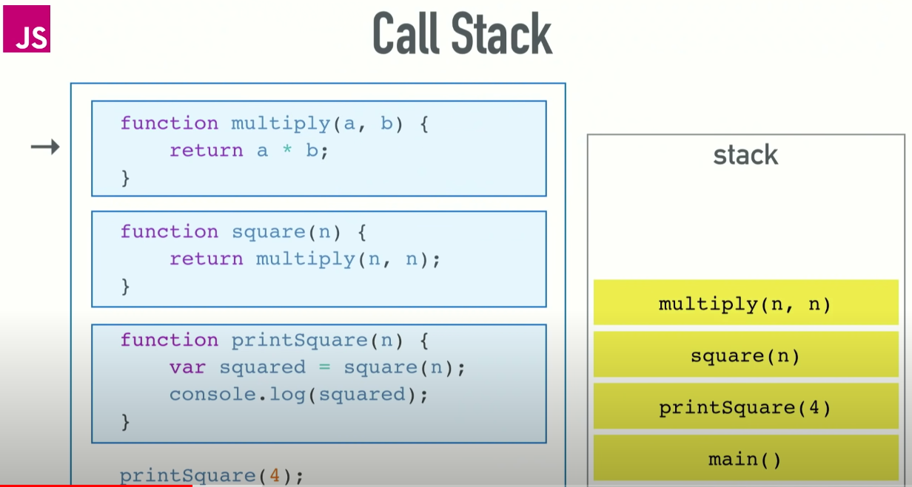

finalmente terminamos y se ve así

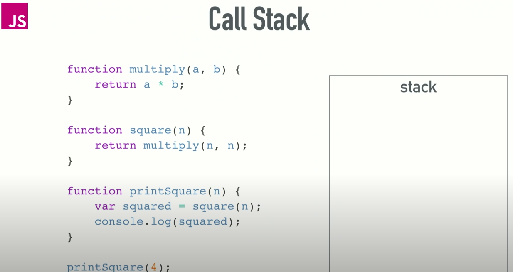

## otro ejemplo

Si es que estamos desarrollando desde el navegador tenemos un código como este

también has escuchado sobre desbordar la pila este es un ejemplo

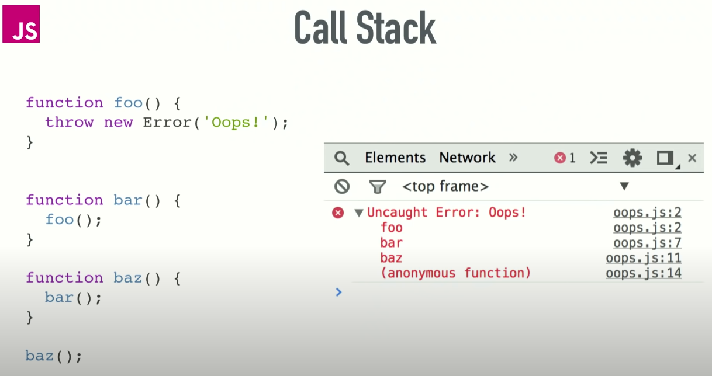

Si tienes una función foo que llama a foo

qué crees que va pasar ?
tenemos a baz, que llama a bar, que llama a foo, que tira un error si lo ejecutamos en chrome

- RangeError

vemos que imprime Ooops! justo el estado de la pila cuando se produjo el error, un error no controlado. Al final chrome dice no creo que quieras llamar a foo 16.000 de forma recursiva asi que me cargaré esto por ti para que puedas buscar el error

## blocking

Qué pasa cuando las cosas van lentas lentas?

Hablamos de bloqueos y comportamientos de bloqueos, realmente no hay una
definición estricta de lo que es o no, nos referimos a que el código va muy lento.

console.log() no es lento, pero hacer un while de uno a diez mil millones si es lento.

- Las peticiones de red son lentas
- descargar imágenes son lentas

**cuando algo lento entra en la pila de llamadas es cuando hablamos de bloqueos**

un ejemplo esto es como código falso getSynchronous

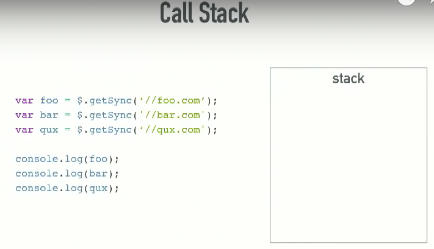

es como jQuery como una solicitud AJAX

Qué pasaría si estas solicitudes fueran síncronas?

👀 olvida lo que sabemos sobre callbacks asíncronos, **ahora son síncronos**

si lo hacemos como antes **llamamos a getSync**

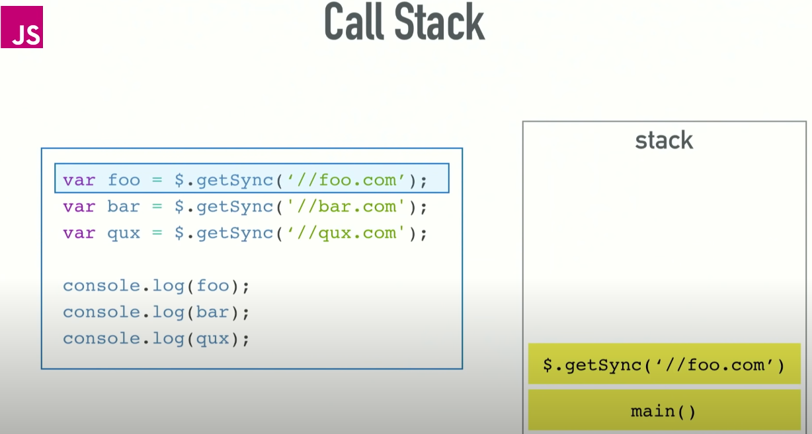

esta haciendo una petición de red, la red entre diferentes equipos es lenta, si hay suerte, esa llamada red se completara y podremos seguir adelante, esperamos, seguimos adelante vamos con la segunda bar

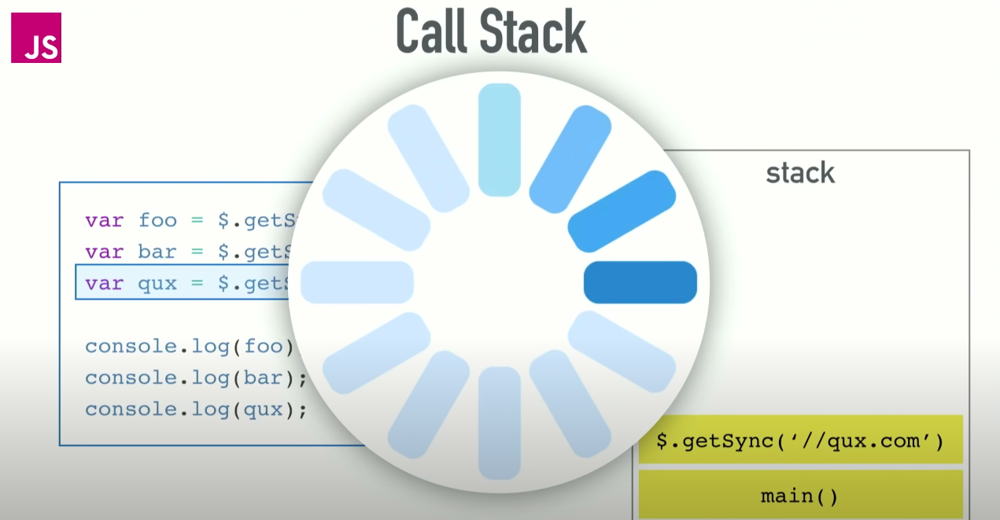

al fin terminan estos 3 comportamientos de bloqueo completos y podemos limpiar la pila bien

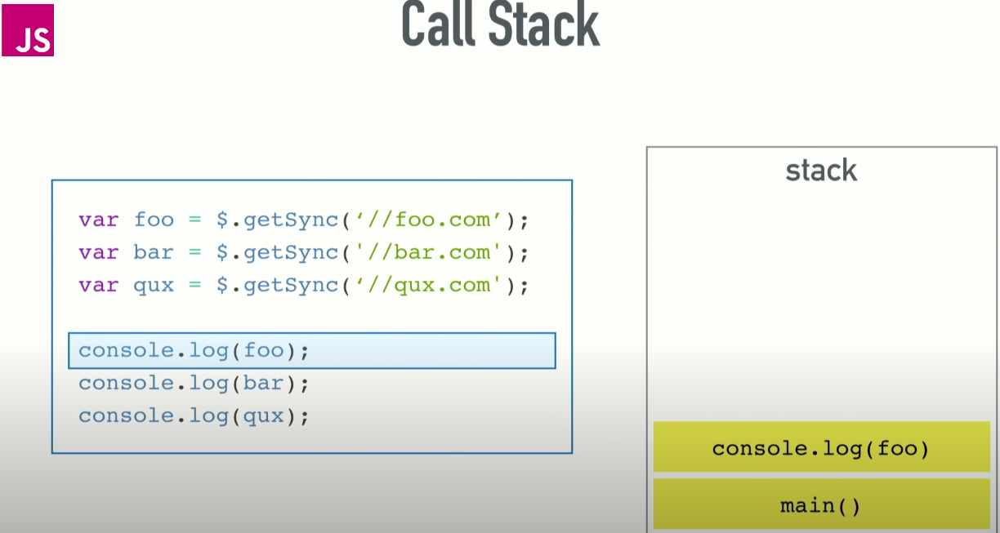


en un lenguaje de programación de monoproceso hay que esperar, no se usan difernetes hilos como lo hace ruby.

Eso es lo que pasa hacemos una solicitud de red y tenemos que esperar a que termine, porque no hay otra forma de gestionar

## Por qué realmente es un problema?

El problema es ejecutar código en los navegadores

vamos a ver un ejemplo anterior en el navegador:

cuando llama a foo veamos que sucede

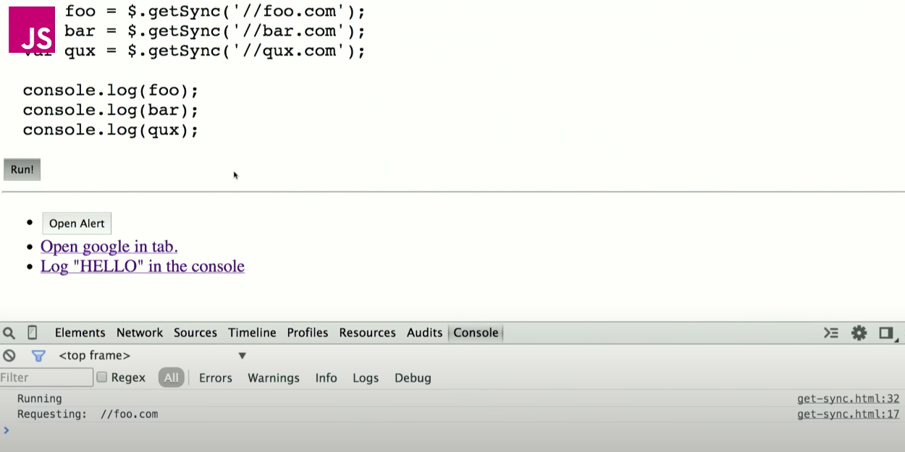

Los navegadores no nos dan solicitudes AJAX síncronas, las estamos imitando con un gran bucle while, que es síncrono, básicamente espero 5 segundos ante de continuar y abrimos la consola

**si lllamamos a foo.com por qué pasa esto?**
no podemos hacer nada, hasta el botón de ejecutar no termina de renderizar el hecho de hacer click en él

- el navegador está bloqueando, se ha colgado no puede hacer nada hasta completar las solicitudes, luego todo va mal porque cosas y me di cuenta que se ejecutan al terminar el proceso y me di cuenta de su acción ya finalizando y ni siquiera podría renderizarlo. No puedo hacer nada.

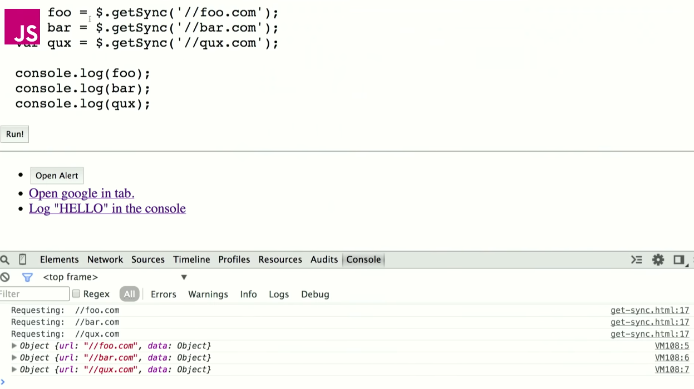

## Entonces cómo gestionamos esto ?

- La solución más simple es que tenemos los callbacks asíncronos, así casi no tendremos funciones que cuelguen al navegador, como en node, que todo es asíncrono lo que básicamente significa que ejecutamos un código le
  damos un callback y lo ejecutamos más tarde

## Un ejemplo simple de como trabaja esto

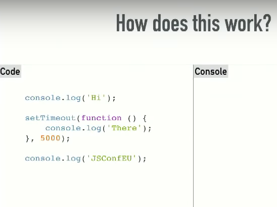

Escribe y ejecutamos setTimeout, pero eso mete el log en la cola para después así que pasamos a JSConf, cinco segundos después escribimos
**"there"**

Entonces cómo funcionan los retornos de la llamadas asíncronas con respecto a las pilas que vimos antes?

vamos a ejecutar el código

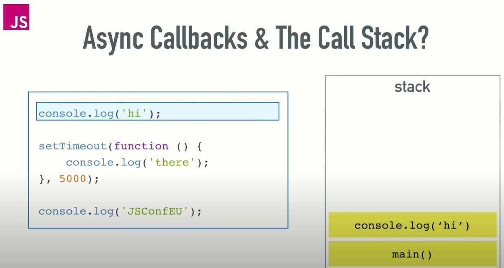

sabemos que no se ejecutara inmediato, que tardar 5 segundos

No lo metemos en la pila simplemente sabemos que desaparece.

example

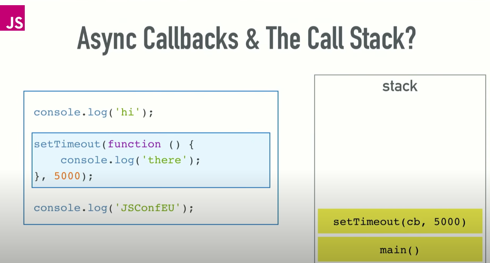

registramos el console.log de JSConfEU, cinco segundos después mágicamente
aparece there en el stack

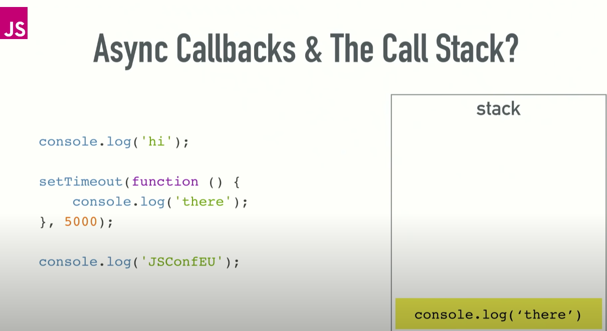

## Concurrency y Event Loop

así es como el bucle de evento entra en **concurrencia**

## Primero veamos la diferencia entre estos conceptos

Concurrencia y paralelismo son conceptos relacionados pero con un importante matiz de diferencia entre ellos. Es por esto que muy a menudo se confunden y se utilizan erróneamente. Vayamos al grano:

**Concurrencia:** cuando dos o mas tareas progresan simultáneamente.
**Paralelismo:** cuando dos o mas tareas se ejecutan, literalmente, a la vez, en el mismo instante de tiempo.

en realidad se miente un poco al decir que javascript solo puede hacer una sola cosa a la vez

- Es cierto que el Runtime de Javascript solo puede hacer una cosa a la vez no puede efectuar una solicitud AJAX. Mientras está ejecutando otro código. No puedes hacer un
  setTimeout mientras se esta ejecutando el código.

- Pero podemos hacer más cosas al mismo tiempo porque el navegador es más que el runtime

recordemos que este diagrama: el Runtime de Javascript puede hacer una cosa a la vez, pero el navegador nos da todo esto, nos da estas API, esto son efectivamente subprocesos a los que pueden hacer llamadas, y esas partes del navegador, que son conscientes de esta concurrencia

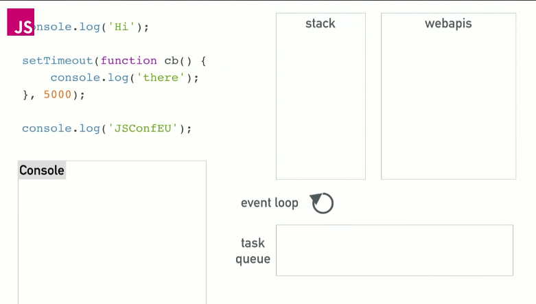

si eres backend este diagrama es casi como en node: en lugar de API WEB tenemos API de C++ y nos oculta el subproceso

ahora que tenemos esta imagen vamos a ver como se ejecuta esto en el navegador:

igual que antes ejecuta el código

- consonle.log() hi

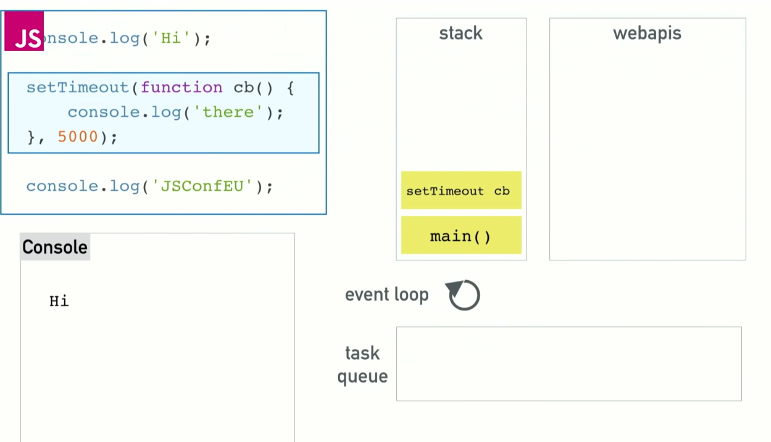

- ahora vamos a ver que pasa con al llamar a setTimeout(), pasamos el callback de esta función y un retraso a llamada setTimeout.

setTimeout es una API que nos proporciona el navegador no existe dentro del V8, son cosas de más que obtenemos al ejecutar el Runtime de Javascript


aquí el navegador inicia un temporizador y ahora gestiona la cuenta atrás, lo que significa nuestra llamada a setTimeout ya esta completa y podemos sacarla de la pila. JSConfEU, limpiar, ahora tenemos el temporizador en la API que se completará cinco segundos después. Pero la API web no puede simplemente cambiar nuestro código, no puede meter cosas en la pila cuando le parezca si lo hiciera, aparecen cosas al azar en medio del código, así que es donde entra en juego la cola de tarea o cola de callbacks(task queue)

Cualquiera de las API Web mete el callback en la cola de tareas cuando está lista, la empuja.

- Finalmente llegamos al **bucle de evento,** pues es como la piecesita más sencilla de toda esta ecuación y tiene un objetivo muy simple. \*\*El trabajo de bucle de eventos es observar la pila y cola de tareas. Si la pila está vacía, coge la primero de la cola y lo mete en la pila, que efectivamente lo ejecuta.

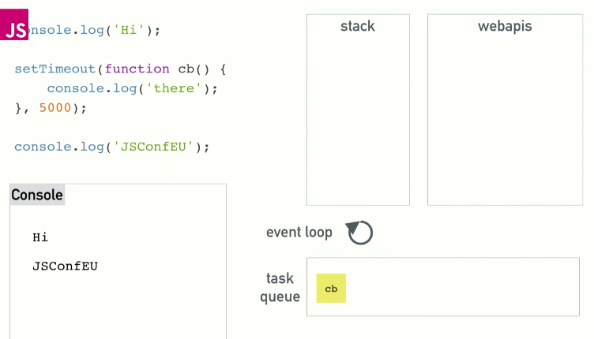

aquí podemos ver que, ahora la pila está limpia hay un callback en la cola de tareas, se se ejecuta el bucle de eventos, dice:
!oh, tengo cosas que hacer! mete callback en la pila

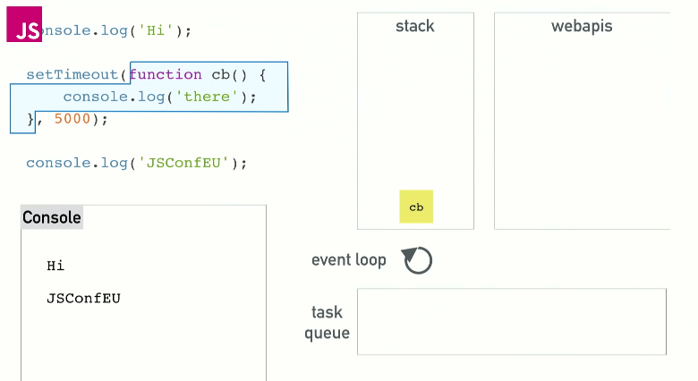

Recuerda que la pila (stack) es terreno de javascript de vuelta al v8, aparece el callback en la pila ejecuta el console.lo()
"there" y hemos terminado


## otro ejemplo setTimeout 0

vamos aplicar un setTimeout pero con 0, la razón es que en general intentas diferir algo hasta que la pila está limpia.

primero ejecuta:

hi
JSConf
there

setTimeout cero se completará de inmediato y lo meterá en la cola, recordemos lo que mencionamos sobre el bucle de eventos, tiene que esperar que la pila este limpia antes de poder meter el callback en la pila para que este siga con la ejecución -> para que siga con la ejecución del console.log()

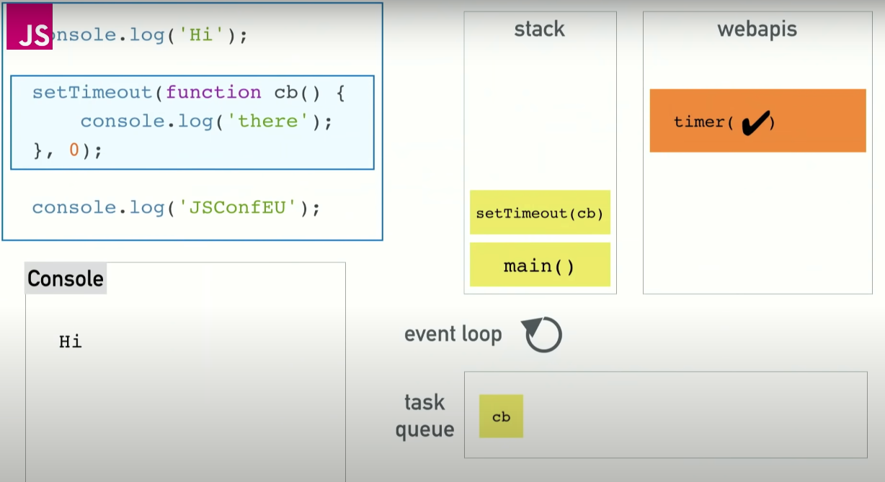

"hi" "JSCONF" y limpiar, ahora el bucle de evento entra en acción y llama al callback

call-cb

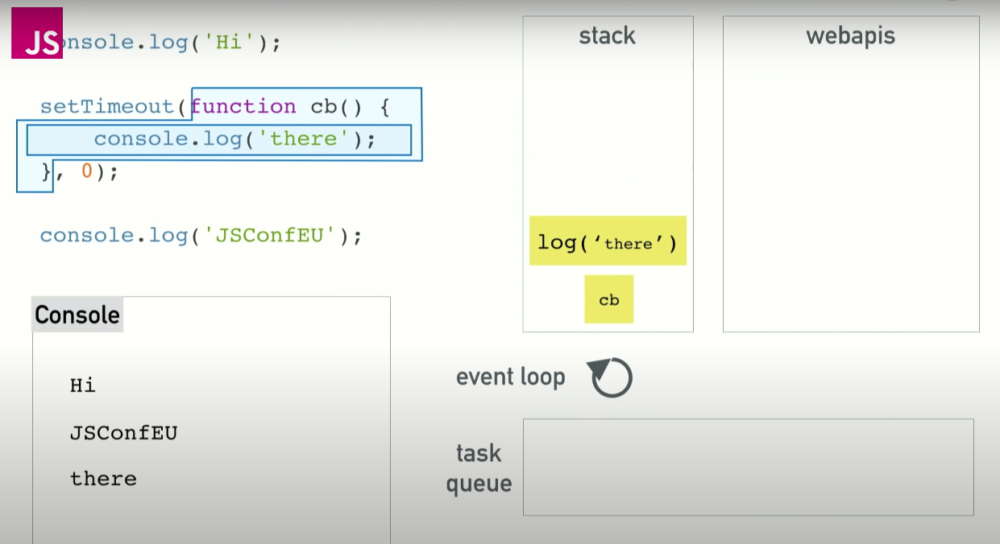

**Eso es un ejemplo de setTimeout con cero, es diferir esa ejecución de código, por el motivo que sea hasta el final de la pila hasta que la pila este limpia**

## solicitud Ajax

Entonces todas estas API Web funcionan igual, si tenemos una solicitud AJAX, hacemos la solicitud a la url con un callback, funciona igual.

console.log("Hi")
hace la solicitud AJAX -> El código para ejecutar esa solicitud AJAX no vive en el runtime de Javascript pero si en navegador como API web, se lo lanzamos a la URL con un callback, **pero sí en el navegador como API web, se lo lanzamos ala URL con un callback y nuestro código puede seguir corriendo.**

Hasta que complete esa solicitud XHR que tal vez nunca se complete, no importa, la pila sigue ejecutando, suponiendo que se complete, se mete a la cola, lo recoge y el bucle de eventos de ejecuta

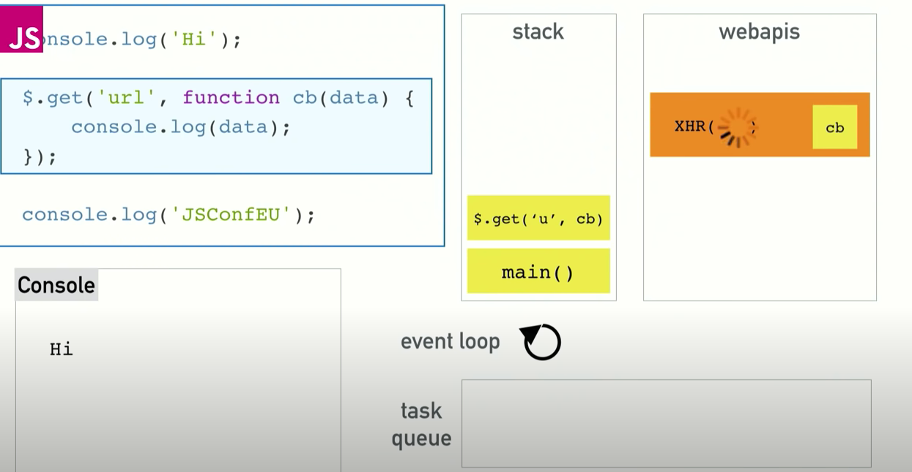

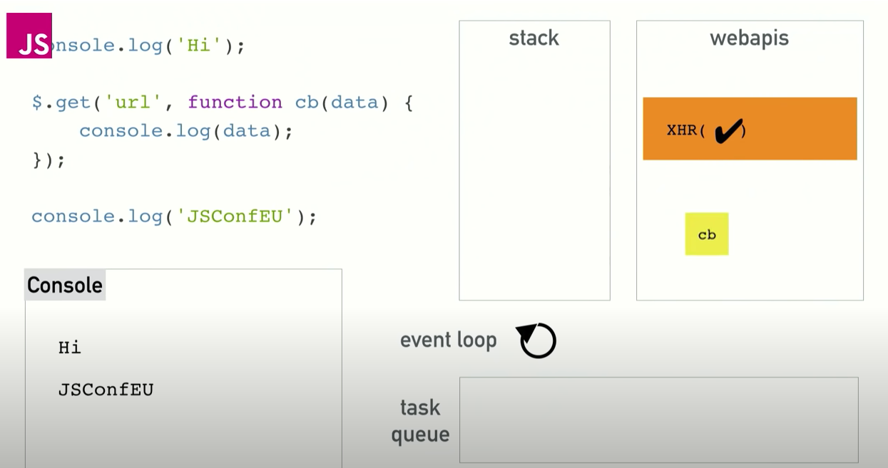

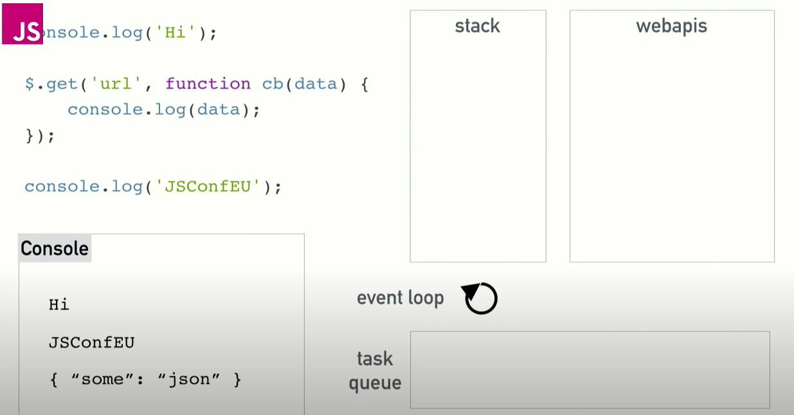

Eso es todo lo que sucede cuando se produce una llamada asíncrona

## vamos con un ejemplo más complicado

vamos a ver le run time de JS

Como se puede ver en el código, vamos a meter un addEventListener por aquí. un setTimeout y luego un console.log().
Vamos a ejecutarlo y a ver que pasa, añadimos una API DOM, un setTimeout

```js
console.log("Started");

$.on("button", "click", function onClick() {
  console.log("Clicked");
});

setTimeout(function onTimeout() {
  console.log("Timeout finished");
}, 5000);

console.log("Done");
```

"tener en cuenta que el onclick es un Web Apis"

vamos a ejecutar el código:

1. console.log("Started")

2. añadimos una API DOM con un un console.log()

3. console.log("Done");

4. añadimos un setTimeout el código sigue ejecutándose, mete el callback en cola -> se ejecuta y hemos terminado.
   Empuja el callback a callback Queue -> ejecuta y hemos terminado

si hago click varias veces podemos ver que pasa:

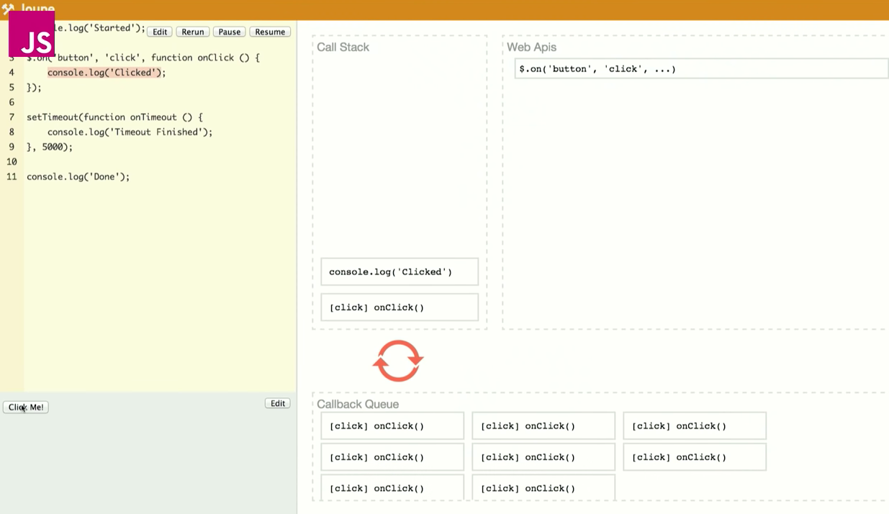

he hecho click pero no se procesa de inmediato, (quedan varios procesos en el callback Queue) luego se mete al call Stack -> se procesa la cola en algún momento se tratara el click correcto

## Otro ejemplo con API asíncronas

En este ejemplo llamamos a setTimeout cuatro veces con un segundo de retraso y un console.log()

```js
setTimeout(function timeout() {
  console.log("hi");
}, 1000);

setTimeout(function timeout() {
  console.log("hi");
}, 1000);

setTimeout(function timeout() {
  console.log("hi");
}, 1000);

setTimeout(function timeout() {
  console.log("hi");
}, 1000);
```

para cuando los callbacks entran en la cola(callback queue) ese cuarto callback tiene un segundo de retraso y todavía está esperando el callback no se ha ejecutado cierto?

**👀 cuando entra el cuartoreciénn comienza a ejecutarse el primer
setTimeout**


**Esto ilustra qué está haciendo no es un tiempo de ejecución garantizado si no un tiempo mínimo para la ejecución al igual que el setTimeout 0 -> no ejecuta el código inmediatamente sino que es lo siguiente que hace, cuando pueda**

## callbacks asíncronos

Vamos hablar sobre los callbacks, los callbacks pueden ser cualquier función que llama a otra función o más explícitamente una devolución de llamada asíncrona que se meterá en la cola de callbacks en el futuro.

Esta sección de código muestra la diferencia, El método forEach en un array, no se ejecuta, toma una función, que podría llamar a un callback pero no funciona de forma asíncrona, si no dentro de la pila actual. Podríamos definir un forEach asíncrono que pudiera tomar un array y un callback, para cada elemento hiciera un setTimeout 0 con ese callback, en teoría debería pasarle el valor, pero vamos a ejecutarlo así vemos cual es la diferencia

```js
//Synchronous
[1, 2, 3, 4].forEach(function (i) {
  console.log(i);
});

//Asynchronous

function asyncForEach(array, cb) {
  array.forEach(function () {
    setTimeout(cb, 0);
  });
}

asyncForEach([1, 2, 3, 4], function (i) {
  console.log(i);
});
```

- El primer bloque de código que se ejecute se quedará ahí
  bloqueando la pila (call stack), **queda bloqueando el hilo**. Se ejecuta una vez por cada elemento
  hasta que se complete

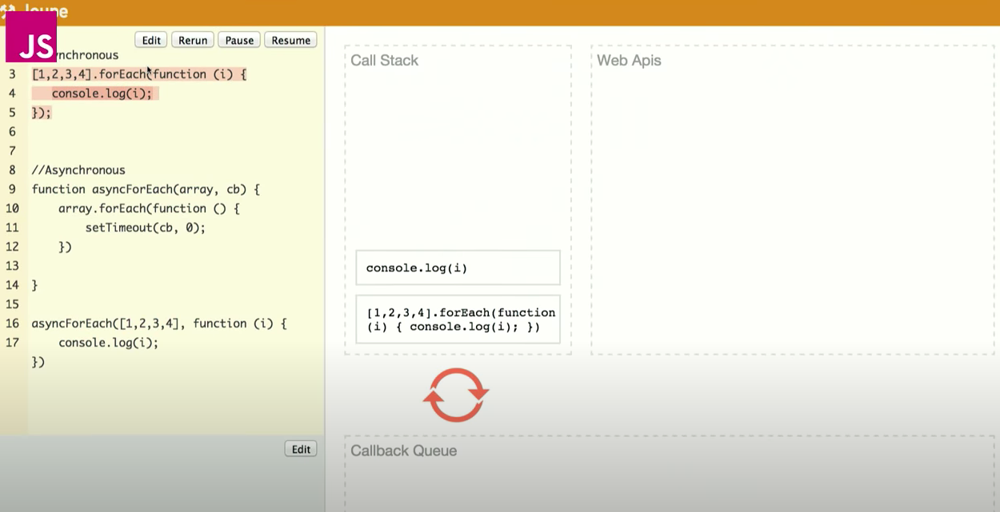

- Mientras que en la versión Async, cierto va más lento, pero básicamente vamos a meter un puñado de callbacks y luego limpiamos el
  callback queue. Si podremos ejecutarlo y hacer console.log()

en este caso el console.log() es rápido por el beneficio de que sea asíncrono no es obvio, pero si tuviéramos un procesamiento lento por cada elemento del array
