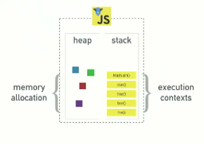

# Event Lopp

## source

[source](https://kriyavikalpa.com/2022/02/12/javascript-quick-revision-2/)

## Cómo funciona realmente javascript ?

Buenos hemos escuchado del V8, el Runtime de chrome pero nada sabía
a ciencia cierta qué era o que hacía. También hemos escuchado sobre monoprocesos o callback

## Javascrip qué rayos eres ?

Soy un lenguaje de monoproceso concurrente.
Yo Tengo:

- Call Stack
- Event Loop
- callback queue

caracteristicas del lenguaje

single threaded
non blocking
asynchronous
concurrent

Tengo un:

- callstack
- heap o memory heap

Si miramos un runtime de Javascript como V8, que es el runtime de chrome
este es una imagen simplificada de lo que es el runtime en JS

## Heap

Es donde se produce la asignación de memoria y la pila de llamadas

heap(asignación de memoria) - stack(pila de tareas o llamadas)

el V8 puede hacer varias cosas como:
setTimeout, DOM y HTTP Request y verás que no están allí, no existen en
V8. Es algo extraño conocer al principio, porque setTimeout lo primero que usas cuando piensas en cosas asíncronas y no estan dentro del v8

lo que hay que entender que tenemos el runtime del v8 pero esas cosas que se llaman asíncronas son las **Web Apis** y que son otras cosas que nos proporciona el navegador

tenemos el mítico event loop y el callback queue(cola de callbacks)

## the call stack

one thread == one callstack == one thing at a time
