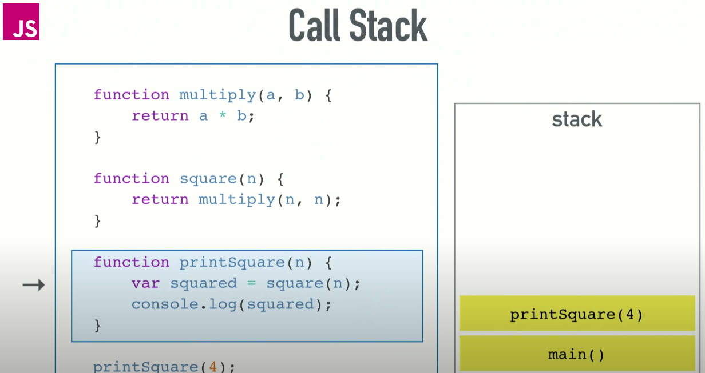
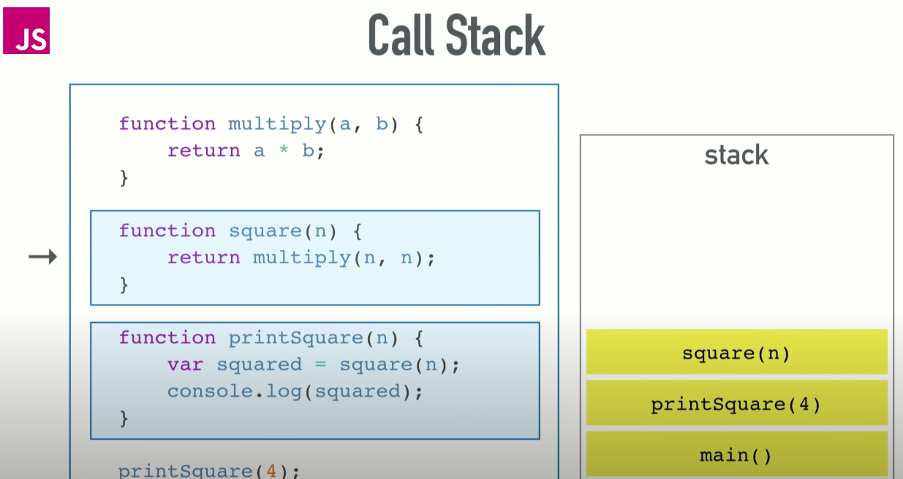
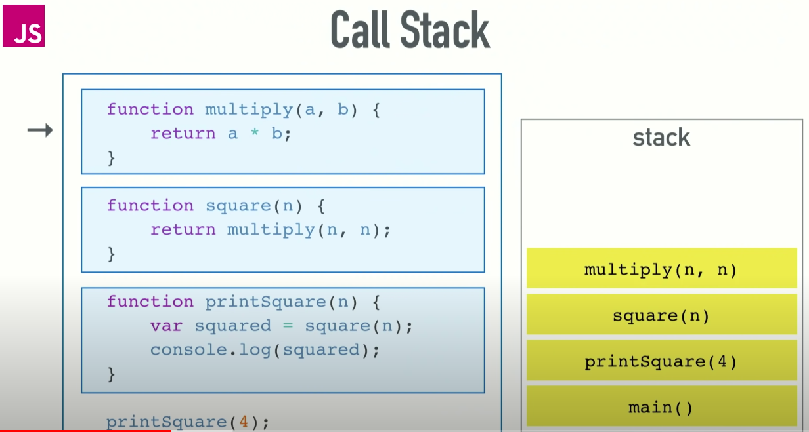
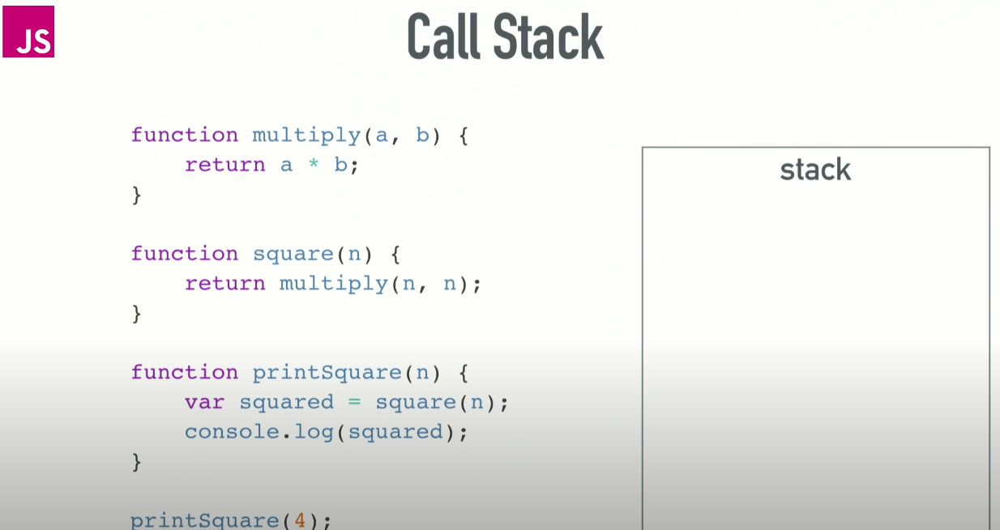
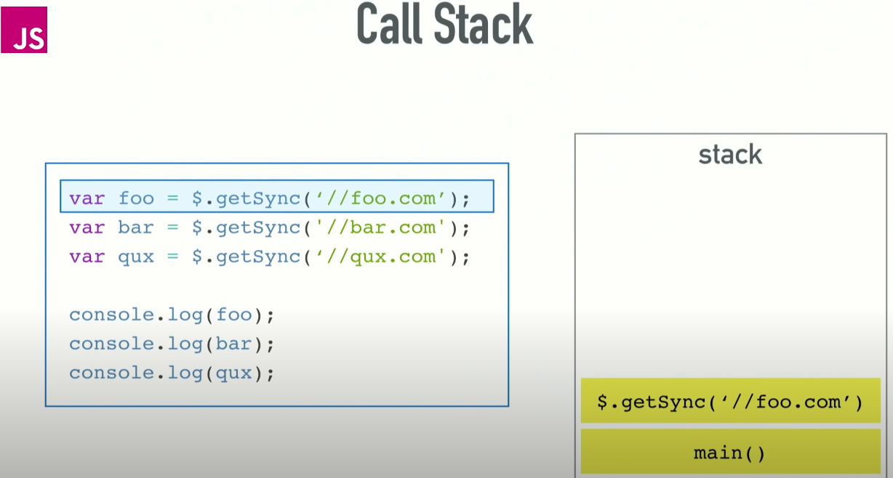
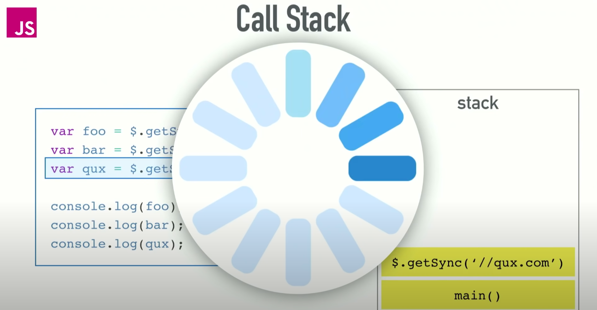
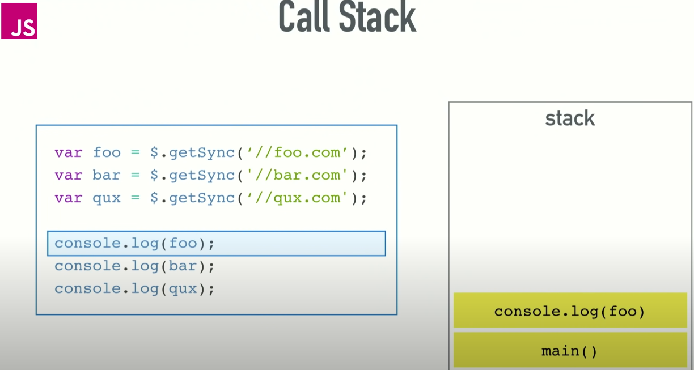
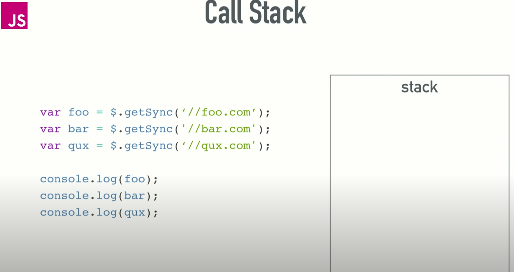

# Event Lopp

## source

[source](https://kriyavikalpa.com/2022/02/12/javascript-quick-revision-2/)

## Cómo funciona realmente javascript ?

Buenos hemos escuchado del V8, el Runtime de chrome pero nada sabía
a ciencia cierta qué era o que hacía. También hemos escuchado sobre monoprocesos o callback

## Javascrip qué rayos eres ?

Soy un lenguaje de monoproceso concurrente.
Yo Tengo:

- Call Stack
- Event Loop
- callback queue

caracteristicas del lenguaje

single threaded
non blocking
asynchronous
concurrent

Tengo un:

- callstack
- heap o memory heap

Si miramos un runtime de Javascript como V8, que es el runtime de chrome
este es una imagen simplificada de lo que es el runtime en JS

## Heap

Es donde se produce la asignación de memoria y la pila de llamadas

heap(asignación de memoria) - stack(pila de tareas o llamadas)

el V8 puede hacer varias cosas como:
setTimeout, DOM y HTTP Request y verás que no están allí, no existen en
V8. Es algo extraño conocer al principio, porque setTimeout lo primero que usas cuando piensas en cosas asíncronas y no estan dentro del v8

lo que hay que entender que tenemos el runtime del v8 pero esas cosas que se llaman asíncronas son las **Web Apis** y que son otras cosas que nos proporciona el navegador

tenemos el mítico event loop y el callback queue(cola de callbacks)

## the call stack

one thread == one callstack == one thing at a time

JavaScript es un lenguaje de programación monoproceso, con un runtime monoproceso y una sola pilla de llama (call stack)

- **Puedo hacer una cosa a la vez, que es lo que significa monoproceso,
  que el programa puede ejecutar una porción de código a la vez**

**Call Stack**

Como podemos ver tenemos alguna funciones como un multiplicador:

- multiply: multiplica dos n√∫meros
- square: llama a la función multiplicar por el mismo número
- printSquare: una función que imprime el cuadrado llamando una función y haciendo luego un console.log
- al final de nuestro archivo ejecutamos printSquare(4)

Si ejecutamos esto:
basicmante el call stack es una estructura de datos que registra en que parte del programa que estamos

si ejecutamos este archivo hay una función main() que viene a ser el propio archivo y eso se mete en la pila, luego tenemos alguna definiciones de funciones y al final tenemos printSquare(4)

eso llama a función -> printSquare(n)

vamos dentro de printSquare se mete en la pila -> square(n)

llama a multiply ahora tenemos un return multiplicamos a y b y regresamos
cuando retornamos sacamos algo de la pila

volvemos a imprimir printSquare(n) en el console.log() no hay retorno es implícito

finalmente terminamos y se ve así

## otro ejemplo

Si es que estamos desarrollando desde el navegador tenemos un código como este

también has escuchado sobre desbordar la pila este es un ejemplo

Si tienes una función foo que llama a foo

qué crees que va pasar ?
tenemos a baz, que llama a bar, que llama a foo, que tira un error si lo ejecutamos en chrome

- RangeError

vemos que imprime Ooops! justo el estado de la pila cuando se produjo el error, un error no controlado. Al final chrome dice no creo que quieras llamar a foo 16.000 de forma recursiva asi que me cargaré esto por ti para que puedas buscar el error

## blocking

Qué pasa cuando las cosas van lentas lentas?

Hablamos de bloqueos y comportamientos de bloqueos, realmente no hay una
definición estricta de lo que es o no, nos referimos a que el código va muy lento.

console.log() no es lento, pero hacer un while de uno a diez mil millones si es lento.

- Las peticiones de red son lentas
- descargar im√°genes son lentas

**cuando algo lento entra en la pila de llamadas es cuando hablamos de bloqueos**

un ejemplo esto es como código falso getSynchronous

es como jQuery como una solicitud AJAX

Qué pasaría si estas solicitudes fueran síncronas?

👀 olvida lo que sabemos sobre callbacks asíncronos, **ahora son síncronos**

si lo hacemos como antes **llamamos a getSync**

esta haciendo una petición de red, la red entre diferentes equipos es lenta, si hay suerte, esa llamada red se completara y podremos seguir adelante, esperamos, seguimos adelante vamos con la segunda bar

al fin terminan estos 3 comportamientos de bloqueo completos y podemos limpiar la pila bien

en un lenguaje de programación de monoproceso hay que esperar, no se usan difernetes hilos como lo hace ruby.

Eso es lo que pasa hacemos una solicitud de red y tenemos que esperar a que termine, porque no hay otra forma de gestionar

## Por qué realmente es un problema?

El problema es ejecutar código en los navegadores

vamos a ver un ejemplo anterior en el navegador:

cuando llama a foo veamos que sucede

Los navegadores no nos dan solicitudes AJAX síncronas, las estamos imitando con un gran bucle while, que es síncrono, básicamente espero 5 segundos ante de continuar y abrimos la consola

**si lllamamos a foo.com por qué pasa esto?**
no podemos hacer nada, hasta el botón de ejecutar no termina de renderizar el hecho de hacer click en él

- el navegador está bloqueando, se ha colgado no puede hacer nada hasta completar las solicitudes, luego todo va mal porque cosas y me di cuenta que se ejecutan al terminar el proceso y me di cuenta de su acción ya finalizando y ni siquiera podría renderizarlo. No puedo hacer nada.

## Entonces cómo gestionamos esto ?

- La solución más simple es que tenemos los callbacks asíncronos, así casi no tendremos funciones que cuelguen al navegador, como en node, que todo es asíncrono lo que básicamente significa que ejecutamos un código le
  damos un callback y lo ejecutamos m√°s tarde

## Un ejemplo simple de como trabaja esto
