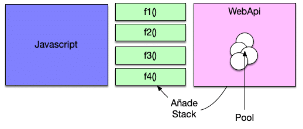

## ¿Es JavaScript síncrono o asíncrono?

La realidad es que el motor de Javascript es sincrono y solo dispone de un Thread (single Thread) de ejecución.
Si nosotros bloqueamos el Thread con un alert a la espera de que confirmemos el motor de Javascript no será capaz de ejecutar nada más y se quedara esperando eternamente.

Esto significa que tiene una pila de tareas y un memory heap. Como se esperaba, ejecuta el código en orden y debe terminar de ejecutar un código de pieza antes de pasar al siguiente. Es sincrónico, pero a veces puede ser perjudicial.

¿Entonces cómo funciona una petición Ajax que todos sabemos que es asíncrona? Ahora tenemos claro que el motor de JavaScript es **sincrono.**

```js
function mensaje() {
  setTimeout(function () {
    console.log("hola desde javascript");
  }, 5000);
}
function alerta() {
  alert("hola");
}
```

```html
<body>
  <input type="button" value="asincrono" onclick="mensaje()" />
  <input type="button" value="alerta" onclick="alerta()" />
</body>
```

Ahora bien si pulsamos ese botón e inmediatamente después pulsamos el botón que nos muestra el alert la realidad es que NO veremos el mensaje de la consola pasados los 5 segundos. De hecho no lo veremos nunca hasta que aceptemos el mensaje del alert. ¿Qué esta ocurriendo? . ¿Es JavaScript sincrono o asíncrono? . La realidad es que el motor de Javascript es sincrono y solo dispone de un Thread de ejecución. Si nosotros bloqueamos el Thread con un alert a la espera de que confirmemos el motor de Javascript no será capaz de ejecutar nada más y se quedara esperando eternamente.

Ahora tenemos claro que **el motor de JavaScript es sincrono**. Las cosas no son tan complicadas como parece.

El navegador tiene un pool de Thread a nivel de WebAPI fuera del runtime de JavaScript que es el que se encarga de realizar estas tareas asíncronas cómo puede ser una petición Ajax . Cuando esa petición Ajax termine el pool registra en la pila de llamadas de JavaScript una nueva función con el resultado de la operación. Esta función será ejecutada por el motor de JavaScript en su event loop de forma sincrona. Es decir en cuando no tenga otra cosa que hacer.



Por lo tanto tengamos siempre en cuenta que el motor de JavaScript siempre es sincrono y todas las peticiones que consideremos asincronas se hacen a traves del pool de Thread de WebAPI que es algo externo. Este al terminar nos devolverá un resultado.

## Async / Await

Hablamos que javascript es un lenguaje de programación de un solo hilo, esto significa si una operación
tarda mucho y no es delegada de manera síncrona **bloquea la ejecución del resto de nuestro
código** esto quiere decir que el programa el intérprete lo puede hacer nada más cuando
esta tarea termine y para solucionarlo se introduce este mecanismo de programación asíncrona, donde yo puedo iniciar una
tarea y puedo esperar cuando haya una respuesta para esta tarea se reanuda la ejecución. Finalmente entrega los
resultados de esta tarea asíncrona y para poder establecer esa comunicación con el mecanismo
interno que javascript maneja para procesar esta peticiones asíncronas se introducen las promesas.

### Las promesas son un objeto que van a producir un valor en el futuro

vimos que con:
-> then podemos dar lectora al valor en caso de exito
-> catch al error en caso de alguna falla
-> con finally independientemente si la promesa esta o esta mal, podemos ejecutar
código

Esto no puede servir en el caso de que la operación asíncrona sea
llamada a la base de datos o haber leído un archivo con finally, con finally podemos
cerrar la conexión o cerrar el archivo o hacer una limpieza final de todo lo que
se haya realizado durante la operación asíncrona. Para eso puede ser útil
finally.

## Las funciones asíncronas permiten que usemos expresiones "await"

Nos permite utilizar alguna o muchas expresiones await dentro del cuerpo de las funciones

**await** -> lo que las expresiones await a su vez nos permiten, es trabajar
con el código asíncrono, con los resultados de una promesa como si fuera código
síncrono.

En ese sentido hablamos de async / await como una mejora sintáctica para que cuando trabajamos
con código asíncrono nos evitemos este tipo de código

```js
let request = fetch("https://api.github.com/users/codigofacilito");
console.log(request);

request.then(function (resultado) {
  console.log("ya termine");
  console.log(resultado);
});

request.catch(function (err) {
  console.log("Petición asíncrona fallada");
  console.log(err);
});

request.finally(function (d) {
  console.log("termine");
});
```

esto lo puedo hacer más fácil, para eso vamos a re escribir este código
en el cual utilizamos fetch -> es el método con el cual podemos hacer una
consulta hacia un servidor, pero eso se procesa de manera asíncrona.

Dentro del cuerpo de la función cada vez que realice una petición asíncrona
puedo anteponer la palabra **await** -> eso lo quiere decir es que la siguiente
linea de código va esperar a que esta termine a que esta termine y entonces
yo puedo procesar el resultado como si fuera código síncrono.
No tengo que manejar **then catch** nada de eso aquí lo que estoy haciendo es que el
resultado de esta operación asíncrona se debe de guardar aquí en response

```js
const leerRepos = async () => {
  const response = await fetch("https://api.github.com/users/codigofacilito");
  console.log(response);
};

leerRepos();
```

aquí lo que recibimos como resultado es un objeto response:

[object Response]

```js
const leerRepos = async () => {
  const response = await fetch("https://api.github.com/users/codigofacilito");
  console.log(response);
};

leerRepos();
```
