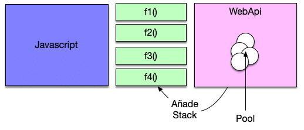

## ¿Es JavaScript síncrono o asíncrono?

La realidad es que el motor de Javascript es sincrono y solo dispone de un Thread (single Thread) de ejecución.
Si nosotros bloqueamos el Thread con un alert a la espera de que confirmemos el motor de Javascript no será capaz de ejecutar nada más y se quedara esperando eternamente.

Esto significa que tiene una pila de tareas y un memory heap. Como se esperaba, ejecuta el código en orden y debe terminar de ejecutar un código de pieza antes de pasar al siguiente. Es sincrónico, pero a veces puede ser perjudicial.

¿Entonces cómo funciona una petición Ajax que todos sabemos que es asíncrona? . Ahora tenemos claro que el motor de JavaScript es **sincrono.**

```js
function mensaje() {
  setTimeout(function () {
    console.log("hola desde javascript");
  }, 5000);
}
function alerta() {
  alert("hola");
}
```

```html
<body>
  <input type="button" value="asincrono" onclick="mensaje()" />
  <input type="button" value="alerta" onclick="alerta()" />
</body>
```

Ahora bien si pulsamos ese botón e inmediatamente después pulsamos el botón que nos muestra el alert la realidad es que NO veremos el mensaje de la consola pasados los 5 segundos. De hecho no lo veremos nunca hasta que aceptemos el mensaje del alert. ¿Qué esta ocurriendo? . ¿Es JavaScript sincrono o asíncrono? . La realidad es que el motor de Javascript es sincrono y solo dispone de un Thread de ejecución. Si nosotros bloqueamos el Thread con un alert a la espera de que confirmemos el motor de Javascript no será capaz de ejecutar nada más y se quedara esperando eternamente.

El navegador tiene un pool de Thread a nivel de WebAPI fuera del runtime de JavaScript que es el que se encarga de realizar estas tareas asíncronas cómo puede ser una petición Ajax . Cuando esa petición Ajax termine el pool registra en la pila de llamadas de JavaScript una nueva función con el resultado de la operación. Esta función será ejecutada por el motor de JavaScript en su event loop de forma sincrona. Es decir en cuando no tenga otra cosa que hacer.



Por lo tanto tengamos siempre en cuenta que el motor de JavaScript siempre es sincrono y todas las peticiones que consideremos asincronas se hacen a traves del pool de Thread de WebAPI que es algo externo. Este al terminar nos devolverá un resultado.
