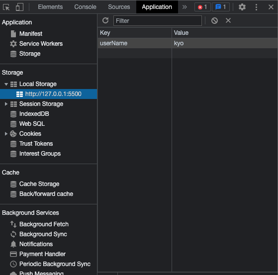

# Local Storage

LocalStorage: Guarda cadena de texto, las guarda con:

## clave => valor

Nosotros tenemos que decirle al navegador cuál va ser la **clave y el
valor**

- el valor recuerda que es un cadena de texto
  Vamos a ver primero unos conceptos ante de pasar de lleno al localStorage

### SET => Guardando

### GET => Obtener

vamos a utilizar los 2, estos 2 están dentro de funciones. Al guardar la cadenas de texto las guarda pero en navegador, esto quiere decir que no se guardan en ningún servidor.

- 👀 Es muy importante que todo lo que guardemos no sea delicado porque otros sitios web podrían acceder al localStorage y obtener información delicada. Por lo tanto vamos a trabajar con información irrelevante para nuestro sitio web

- El localStorage se guarda en el navegador el navegador es del cliente
  por lo tanto cada cambio que nosotros realizamos en sitio web, lo vamos a ver nosotros y no lo va ver el resto

### para guardar esa cadena de texto en nuestro localStorage usamos

**setItem()**

- primero pasamos la clave que puede ser el nombre queramos y luego pasamos el valor (key - value)

```js
const name = "kyo"; //cadena texto es un string

localStorage.setItem("nameUser", name);
```

podemos ver que hemos guardado la variable con el nombre que pasamos.



si actualizamos nuestro sitio web vamos ver que siempre en la ventana vamos a tener esto va a ser permanente

- Tenemos localStorage y Session Storage. La unica diferencia esque Session Storage todo se pierde el Local Storage no, mientra el navegador no limpie el cache los datos van estar vigentes, si le damos a la x esto desaparece pero como lo tenemos en nuestro javascript, cada vez que se ejecute lo va guardar y debe aparecer de nuevamente.

- IndexDb es un base de dato mucho más compleja

### Como lo obtenemos los datos de mi localStorage con **getItem()**

- vamos a poner nuestro localStorage.getItem() -> cuando nosotros tenemos getItem
  tenemos que indicarle la clave cual es la clave **"nameUser"**

```js
const nombreLocalStorage = localStorage.getItem("nameUser");
```

### Vamos a remover ahora lo que tenemos en localStorage con **removeItem()**

```js
localStorage.removeItem("userName");
```
