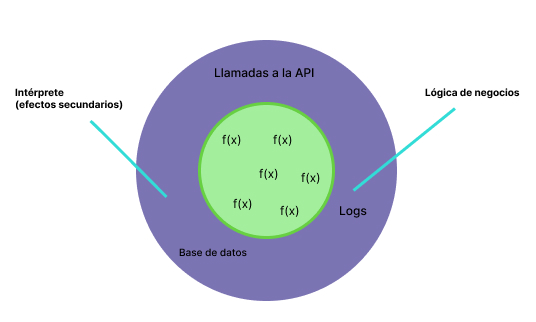

# Qué es la programación funcional

Aunque existe detalles matemáticos alrededor del trabajo en programación funcional,
abordaremos

Escribir un programa en programación funcional es similar a definir una rutina
con distintos pasos, donde cada paso es una función a lo largo de la rutina
vamos a pasando la información que queremos procesar.

- Pipelining
- composición de funciones

Para lograrlo se aplican algunas reglas que aplican en el paradigma.

- Funciones de responsabilidad única (una sola tarea)
- Funciones puras (no producen efectos secundarios)

## Efectos secundarios

Decimos que una función produce efectos secundarios cuando interactúa
con elementos que estás fuera del cuerpo.

Una función debe recibir la información que necesita vía parámetros, y comunicar
resultados vía el retorno

- Algunos ejemplos de efectos secundarios son:
- Usar una variable global
- Modificar una variable referenciada
- Imprimir logs
- Hacer una llamada a una API
- Modificar algo en pantalla modificar el (DOM)
- Escribir en un archivo

## Funciones Puras

Lo que nosotros buscamos en programación funcional es que no produzca ningún efecto secundario
y como resultado de esto esta pueden ser clasificadas como funciones puras.

> Decimos que una función es pura si es determinista y no produce efectos secundarios.

Decimos que algo es determinista cuando podemos determinar el resultado que tendría una operación.
Si tiene los mismos argumento, la función debe producir los mismos resultados.

## ¿Qué hace una función impura?

```js
let numeroUno = 20;
let numeroDos = 10;

function suma() {
  console.log(numeroUno + numeroDos);
}
```

- Usar variable globales
- Imprimir en consola

No es determinista porque no estamos seguro de que de numeroUno y numeroDos van a tener
siempre el mismo valor

ejemplo:

```js
let numeroUno = 20;
let numeroDos = 10;

function suma() {
  console.log(numeroUno + numeroDos);
}

suma(); //30

numeroUno = 15;
suma(); //25
```

## ¿Es esta función pura?

```js
async function getResponse() {
  let repos = await (
    await fetch("https://api.github.com/user/codigofacilito/repos")
  ).json();
  for (let i = 0; i < repos.lenth; i++) {
    console.log(repos[1].name);
  }
}

getResponse();
```

el for lo hace que no sea muy funcional. No es muy funcional usar ciclos pero no lo hace
impura, podríamos tener un ciclo for dentro de una función pura.

**La respuesta en No**

- Tiene una llamada a una API externa
- Imprime en consola

## No es determinista porque

- Puede Fallar si la API no esta disponible
- Entrega diferentes resultados según la respuesta de la API cambié
- Puede fallar si los logs no están disponibles o si algo falla al escribir en los
  logs

En un programa diseñado de manera funcional, buscamos tener un core de funciones puras
con la lógica de negocio, y en el exterior las tareas que finalmente producen efectos
secundarios.



En el centro tenemos toda la lógica de negocio con funciones puras.

- Cálculos
- Operaciones
- Transformaciones de datos
  - no necesitan producir efectos secundarios

En una capa mas al exterior, cercana a la última respuesta, todo lo que finalmente
pueda producir efectos secundarios.

- Llamadas a la API
- Llamadas a la base de datos
- impresiones en el log

Considera un problema en el que:

- Debes extraer valores de un excel
- Y ejecutar un cálculo sobre estos valores

Mi función:

1- Abrir excel
2- leer los valores
3- Guardar los valores en un arreglo
4- Ejecutar cálculo sobre el arreglo

¿ Como asegurarnos que esto funcione bien?

Preparar un suit de pruebas para una función que produce efectos secundarios, es mucho más
complejo que prepara una prueba para una función que es pura y está isolada.

Puedes pensar en pruebas unitarias, en un programa donde no existe esa separación, yo tendría
que preparar un entorno de prueba más complejo. Que haga mock o simule excel, simule la extracción
de datos y simule toda la parte exterior al cálculo, para luego poder isolar el cálculo y testearlo.
Es complejo.

- Separo las funciones por tareas específicas
- Cuando separamos es más fácil validar funcionalidades:
  - solo importa que parámetros le mando y qué resultados genera
- No importa que las otras funciones sean puras

```js
//función pura
function obtenerReposNames(repos) {
  return repos.map((repo) => repo.name); //return implicito
}

//cada una de las funciones tiene un responsabilidad unica

//no es pura por el efecto secundario
function imprimirRepos(repos) {
  for (let i = 0; i < repos.length; i++) {
    console.log(repos[i]);
  }
}

//no es pura por el efecto secundario
async function obtenerRepos() {
  let response = await window.fetch(
    "https://api.github.com/users/codigofacilito/repos"
  );
  let repos = await response.json();
  return repos;
}

//Aquí no puedo usar await porque no estoy dentro de una función asyncrona, puedo utlizar promesas

let repos = obtenerRepos().then(function (repos) {
  let resposName = obtenerReposNames(repos);

  imprimirRepos(resposName);
});
```

Esto produjo más código, no pasa nada, producir más código, no necesariamente es señal de mal
código, a veces más código es mejor, simplemente tiene que ser expresivo y mantenible

- Una función pura tiene que ser determinista **(con los mismos argumentos siempre entregue el
  mismo resultado eso es lo que la hace determinista)**
- Aunque yo no sepa el detalle de la función, siempre va a devolver el mismo resultado, por ejemplo 20
  un número
- Si corres la función con **X**, mañana con los mismos argumentos te tiene que devolver lo mismo
- Cuando tiene efecto secundario eso determinista ya no se puede aplicar

Predecible no quiere decir que yo de ante mano sé qué resultado va a tener, sino que siempre
va a hacer el mismo resultado si yo lo mando con los mismos argumento, lo único que puedo
predecir de una función determinista es que si la mando con los mismos argumentos entrega el mismo
resultado.
