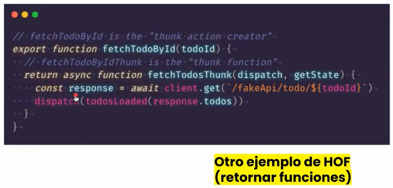

## High Order Functions

Llamamos high Orders Functions a las funciones que reciben una función
como argumento o retornan una función como resultado.

# JavaScript

En javascript las funciones son objetos de primera clase.

Pueden ser usados como argumentos, una función puede retornar otra función o
pueden ser almacenadas como variables.

Esto es lo que podemos decir de un objeto de primera clase.

```js
let numeros = [1, 2, 3, 4];
let cuadrados = [];

for (let i = 0; i < numeros.length; i++) {
  let número = numeros[i];
  cuadrados.push(numero * numero);
}

console.log(cuadrados);
```

## Este es un HOF

Porque la función map esta recibiendo como argumento otra función y ya con esa función
ejecuta otra operaciones. Map, reduce y filter todas ellas son HOF por que reciben una
función como parametro, cualquiera que reciba un callback es una HOF también, forEach
entre otras.

```js
let numeros = [1, 2, 3, 4];
let cuadrados = numeros.map((numero) => nuemero * numero);
console.log(cuadrados);
```

## HOF en redux thunk

un action creator retorna una función asincrona, tanto que reciba o esté retornando una función
eso me clasifica como un HOF.



Programación funcional HOF

**forEech** es un método de los arreglos, que permite recibir una función como argumento y esta
función se va a ejecutar para cada uno de los elementos dentro del arreglo. Lo que hace
forEach es recibir como argumento una función.

```js
//forEach

let numeros = [1, 2, 3];

numeros.forEach((num) => console.log(num));
```

**map** me permite recibir una función que se ejecutara una vez para cada elemento del arreglo.
Lo que diferencia map de forEach, es que va ultizar que retorne cada ejecución para crear un nuevo
arreglo. Lo que retorne la función en este caso sería el cuadrado 1, 4 y 9 va a guardarlo
internamente en un nuevo arreglo que nos va a entregar como resultado. Map, filter y reduce no
modifican el arreglo original que es muy importante en la programación funcional.

```js
let numeros = [1, 2, 3];

let cuadrados = numeros.map((num) => num * num);
console.log(cuadrados);
```

**filter** el resultado de la función ejecutada para cada uno de los elementos se evalúa como
**true o como false** y dependiendo de eso se genera un nuevo arreglo con todos lo que dieron
true

```js
let numeros = [1, 2, 3];

let pares = numeros.filter((num) => num % 2 == 0);
console.log(pares); //2
```

```js
let numeros = [1, 2, 3];

let pares = numeros.filter((num) => true); //si retorno true el nuevo arreglo va ser igual
//al arreglo original

let paresSecond = numeros.filter((num) => false); //todos los va a limpiar
//al arreglo original
console.log(pares); //[1, 2, 3]
console.log(paresSecond); //[]
```

Si num % 2 == 0 aqui retorna true, (num) este valor se guarda en nuevo arreglo y el resulta
de toda la operación son los elementos para los cuales la ejecución de la función dio true

**reduce** nos permite aplicar una operación de reducción para un arreglo y así posiblemente
reducirlo a un solo valor, recibe una función que se aplica para cada elemento del arreglo.
La principal diferencia con el resto de operaciones es que reduce guarda un acumulador entre cada
ejecución y el resultado **es lo que sea que retorne la ultima ejecución**

Vamos a utilizar reduce para obtener la suma de todos los elementos en este arreglo.
El primer argumento -> es un valor acumulado, que se pasa entre cada ejecución de la función
El segundo argumento -> es el valor que esta iterando
Tercer argumento -> recibe el valor inicial para el acumulador

```js
let numeros = [1, 2, 3];

let suma = numeros.reduce((acumalador, numero) => acumalador + numero, 0);
console.log(suma);
```

Qué es lo que pasa acá:

- Inicialmente acumulador vale 0
- Entra en al ejecución de esta función
- La primera ejecución numero vale 1, entonces retorna 0 + 1
- Esto que retorno se va utilizar como acumulador para la segunda ejecución
- Entonces en la segunda ejecución acumulador ya vale 1 y numero vale 2
- 1 + 2 daría 3 y eso sería el retorno, ese 3 se utlizaría para la siguiente ejecución
- En esa última acumulador valdría 3 número también valdría 3, 3 + 3 sería 6 y ese él
  resultados que obtendríamos
- Esto se puede ejecutar sobre matrices si, pero deberías aplanarlo, si tu arreglo contiene arreglos
  esos argumentos alguna vez te van a retornar un arreglo

  ## Por qué utilizamos HOF en lugar de ciclos

  En general, por qué utilizamos funciones para trabajar con arreglos en lugar de utilizar ciclos
  porque todo esto lo podemos hacer con un ciclo for o while, pero existe estas alternativas
  que son usadas más en programación funcional.

  - Una de ellas es composición

  Dado este arreglo necesitó la suma de los números pares, necesito sumar únicamente los
  pares, hay varias formas de resolver esto:

  ## Lista de pasos

  - primero uso map para convertir los string en enteros, esto en nuevo arreglo va estar
    en formato entero
  - después voy utlizar filter, para unicamente quedarme con lo que sean pares
  - Luego reduce, para sumar todos los que al final de cuenta fueron pares
  - Una vez que conozca que hace map filter y reduce es mucho más legible aplicar
    programación declarativa
  - composiciones pipeline una vez tiene el resultado se aplica el siguiente método

  ```js
  //programación declarativa
  let numeros = ["2", "4", "7", "6"];

  let sumaPares = numeros
    .map((numero) => parseInt(numero))
    .filter((numero) => numero % 2 == 0)
    .reduce((acc, numero) => acc + numero, 0); //12

  console.log(sumaPares);
  ```

Esto es exactamente lo mismo que el ejemplo anterior que aplica map, filter y reduce

Cada detalle, cada paso está aquí en la programación imperativa, acá lo tengo que decir
de una manera más detallada

```js
//programación imperativa
let numeros = ["2", "4", "7", "6"];
let suma = 0;

for (let i = 0; i < numeros.length; i++) {
  let numeroStr = numeros[i];
  let numeroInt = parseInt(numeroStr);

  if (numeroInt % 2 == 0) {
    suma += numeroInt;
  }
}
```

- Es más rápido for, pero en una escala que es irrelevante, términos práctico si existe
  una diferencia entre forEach y for

No es mal código ciclos, sobre funciones. Son dos maneras de pensar y
de abordar un problema.
